# Universal A2A Agent — Zero-to-Hero Tutorial

This guide shows **the easiest ways to turn any Python logic into a full A2A agent** with:

* `POST /a2a` (raw A2A)
* `POST /rpc` (JSON-RPC 2.0)
* `POST /openai/v1/chat/completions` (OpenAI-compatible)
* `GET /.well-known/agent-card.json` (discovery)
* `GET /healthz`, `GET /readyz` (ops)

We’ll start with a **one-function agent**, then a **LangGraph Debugger agent**, and finish with a **LangGraph multi-agent** — all using the upgraded `universal-a2a-agent`.

---

## 0) Install & prepare

```bash
pip install universal-a2a-agent
# (Optional) if you’ll use LangGraph / LangChain models:
pip install langgraph langchain-core
```

Choose a provider **only if you want real inference**. Otherwise use `echo` (no creds).

**Watsonx.ai**

```bash
pip install langchain-ibm ibm-watsonx-ai
export LLM_PROVIDER=watsonx
export WATSONX_API_KEY=...
export WATSONX_URL=https://us-south.ml.cloud.ibm.com
export WATSONX_PROJECT_ID=...
export MODEL_ID=ibm/granite-3-3-8b-instruct
```

**OpenAI**

```bash
pip install langchain-openai
export LLM_PROVIDER=openai
export OPENAI_API_KEY=...
export MODEL_ID=gpt-4o-mini
```

**Local echo (no creds)**

```bash
export LLM_PROVIDER=echo
```

**Nice-to-have**

```bash
export PUBLIC_URL=http://localhost:8080         # improves card links
# if behind a reverse proxy/sub-path:
export A2A_ROOT_PATH=/agent                     # keeps OpenAPI/card URLs correct
```

> If you run via `a2a_universal.run(...)`, a local `.env` is auto-loaded when `python-dotenv` is installed.

---

## 1) Easiest possible agent (one function → full A2A)

### `examples/simple_agent.py`  

```python
# examples/simple_agent.py
from a2a_universal.app import build
from a2a_universal import run

async def handle_text(text: str) -> str:
    return f"Hello from my custom agent. You said: {text[:200]}"

# Build a full A2A app from a single function
app = build(
    handler=handle_text,
    name="Tiny Agent",
    description="One function → full A2A",
)

if __name__ == "__main__":
    # Tip: for a pure A2A app, you can also do run(..., mode="solo")
    run("__main__:app", host="0.0.0.0", port=8080, reload=False)
```

Run it:

```bash
python examples/simple_agent.py
```

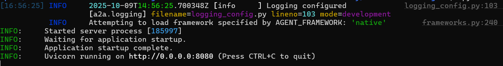


Test it:

```bash
# health
curl -s http://localhost:8080/healthz
```

{"status":"ok"}

```bash
# discovery
curl -s http://localhost:8080/.well-known/agent-card.json | jq
```
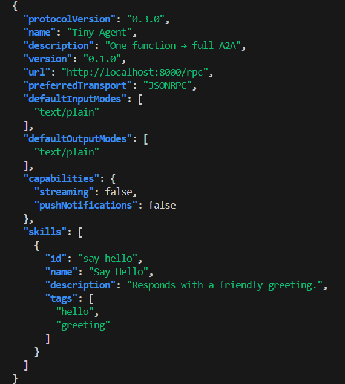

```bash
# raw A2A
curl -s http://localhost:8080/a2a \
  -H 'Content-Type: application/json' \
  -d '{
        "method":"message/send",
        "params":{"message":{
          "role":"user","messageId":"m1",
          "parts":[{"type":"text","text":"Ping from A2A"}]
        }}
      }' | jq
```
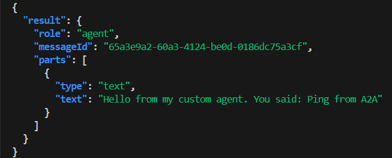
```bash
# OpenAI-compatible
curl -s http://localhost:8080/openai/v1/chat/completions \
  -H 'Content-Type: application/json' \
  -d '{"model":"tiny-agent","messages":[{"role":"user","content":"What is A2A?"}]}' \
  | jq -r '.choices[0].message.content'
```


```bash
# JSON-RPC
curl -s http://localhost:8080/rpc \
  -H 'Content-Type: application/json' \
  -d '{"jsonrpc":"2.0","id":"1","method":"message/send","params":{"message":{"role":"user","messageId":"cli","parts":[{"type":"text","text":"Hello via JSON-RPC"}]}}}' \
  | jq
```
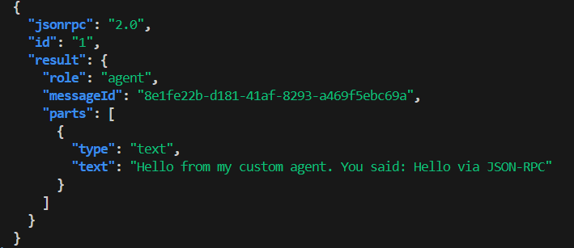


In our server we have different calls made by you


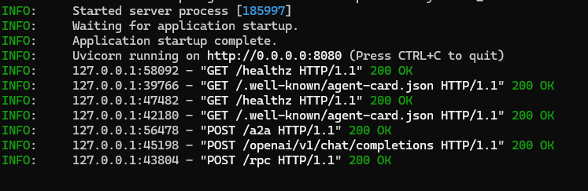


---

## 2) Same idea, different entrypoint (`mount` convenience)

The `mount(...)` function now supports **function mode** too — pass a `handler=` and it builds an A2A app for you. Use this if you like the shorter import.

### `examples/tiny_agent.py`  

```python
# examples/tiny_agent.py
from a2a_universal import mount, run

async def handle_text(text: str) -> str:
    # Your logic (call libs, query KBs, rule-engine, etc.)
    return f"Hello from my custom agent. You said: {text[:200]}"

# Build a full A2A app from a single function (agent-card, /a2a, /rpc, /openai, health)
app = mount(handler=handle_text, name="Tiny Agent", description="One function → full A2A")

if __name__ == "__main__":
    run("__main__:app", host="0.0.0.0", port=8080, reload=False)
```

> Under the hood, `mount(handler=...)` delegates to the same builder used in §1.

You can test our a2a agent by installing a simple webapp a2a validator here
(https://github.com/agent-matrix/a2a-validator)[https://github.com/agent-matrix/a2a-validator]

For example, 
Pull
```bash
docker pull docker.io/ruslanmv/a2a-validator
```
Run (maps host 7860 → container 7860)
```bash
docker run --rm -p 7860:7860 docker.io/ruslanmv/a2a-validator
```
and insert our server a2a

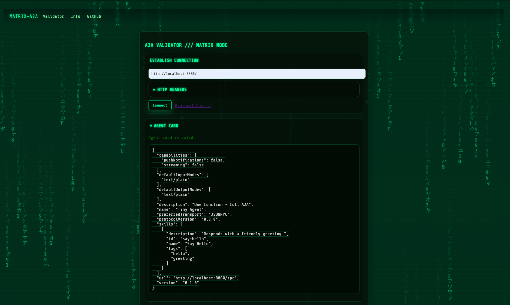
and also we can chat with out agent a2a

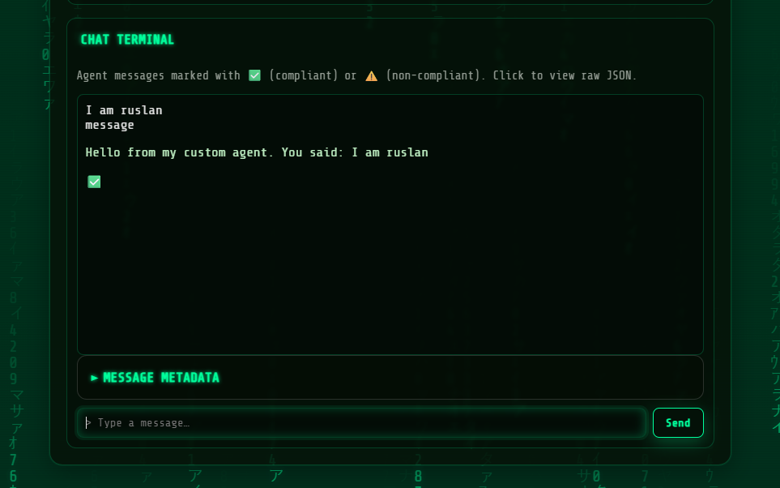


---

## 3) One-file LangGraph → A2A (Debugger Agent)

This wraps a tiny LangGraph that explains errors and suggests fixes. It uses the **active provider** (`LLM_PROVIDER`) via `langgraph_llm()`.


First assure that you have your .env file in the path where you have the python code,


.env

```bash
# Provider and Framework Selection
LLM_PROVIDER=watsonx
AGENT_FRAMEWORK=langgraph

# IBM watsonx.ai Credentials
WATSONX_API_KEY=
WATSONX_URL=https://us-south.ml.cloud.ibm.com
WATSONX_PROJECT_ID=
MODEL_ID=ibm/granite-3-3-8b-instruct # Optional: specify a different model
```
then you type

```bash
python examples/debugger_agent_server.p
```


### `examples/debugger_agent_server.py`  

```python
# examples/debugger_agent_server.py
from __future__ import annotations
import os

from langgraph.graph import StateGraph, END, MessagesState
from langchain_core.messages import HumanMessage, AIMessage

from a2a_universal import mount, run
from a2a_universal.provider_api import langgraph_llm

# 1) Build the "Debugger" graph
llm = langgraph_llm()  # uses LLM_PROVIDER & creds from env

async def debug_node(state):
    user_text = state["messages"][-1].content
    prompt = (
        "You are a senior Python debugging assistant. "
        "Explain the root cause of the error, then show corrected code.\n\n"
        f"{user_text}"
    )
    resp = await llm.ainvoke([HumanMessage(content=prompt)])
    return {"messages": [AIMessage(content=resp.content)]}

sg = StateGraph(MessagesState)
sg.add_node("debugger", debug_node)
sg.add_edge("__start__", "debugger")
sg.add_edge("debugger", END)
graph = sg.compile()

# 2) A2A handler
async def handle_text(text: str) -> str:
    out = await graph.ainvoke({"messages": [HumanMessage(content=text)]})
    return out["messages"][-1].content

# 3) Build A2A app
app = mount(
    handler=handle_text,
    name=os.getenv("AGENT_NAME", "Debugger Agent"),
    description="Explains Python stack traces and suggests fixes.",
)

# 4) Run
if __name__ == "__main__":
    run("__main__:app", host="0.0.0.0", port=int(os.getenv("PORT", "8080")), reload=False)
```
You will have something like 

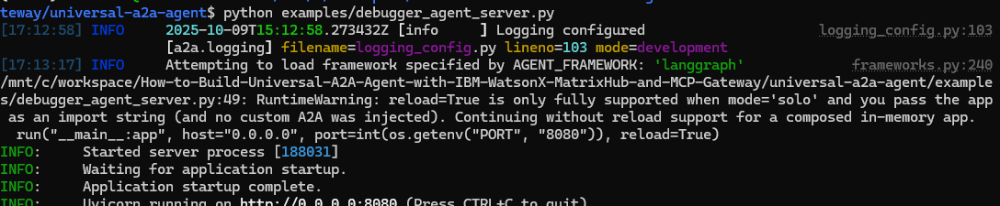

You can try with this error , copy and paste in the validator

```
Error: TypeError: unsupported operand type(s) for +: int and str\n\nCode:\nprint(5 + \"hello\")
```

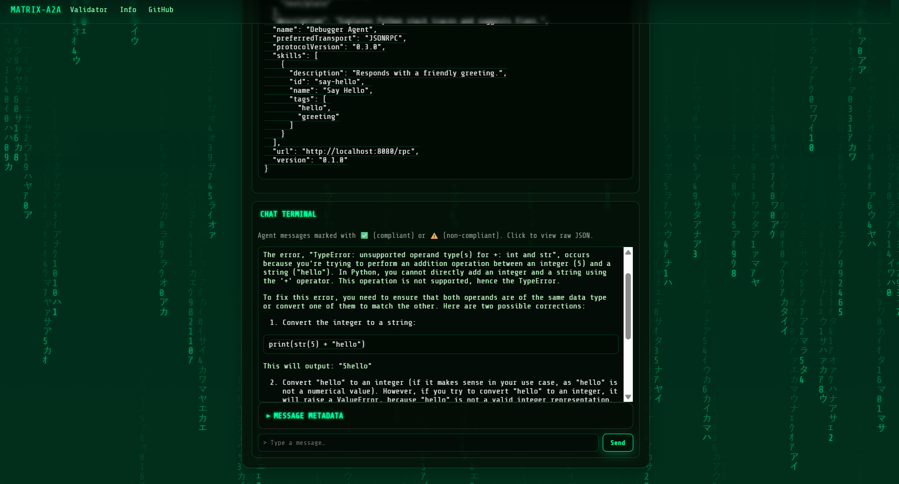

Try:

```bash
curl -s http://localhost:8080/rpc \
  -H 'Content-Type: application/json' \
  -d '{
    "jsonrpc":"2.0",
    "id":"1",
    "method":"message/send",
    "params":{
      "message":{
        "role":"user",
        "parts":[{"type":"text","text":"Error: TypeError: unsupported operand type(s) for +: int and str\n\nCode:\nprint(5 + \"hello\")"}]
      }
    }
  }' | jq -r '.result.parts[0].text'

```
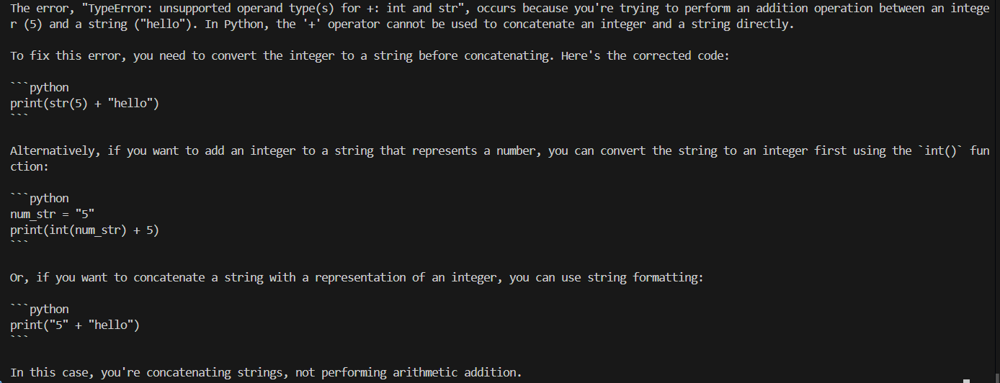
---

## 4) Multi-agent LangGraph with routing (e.g., Watsonx)

Two skills in one service: **Debugger** and **Docs**. We route by message content.

### `examples/multi_agent_server.py`  

```python
# examples/multi_agent_server.py
from __future__ import annotations
import os, re
from typing import Dict, Any
from dotenv import load_dotenv
# -------------------------------------------------------------------
# Load environment variables
# -------------------------------------------------------------------
load_dotenv()
from langgraph.graph import StateGraph, END, MessagesState
from langchain_core.messages import HumanMessage, AIMessage

from a2a_universal import mount, run
from a2a_universal.provider_api import langgraph_llm

llm = langgraph_llm()  # uses watsonx/openai/etc. from env

async def debugger_node(state: Dict[str, Any]) -> Dict[str, Any]:
    text = state["messages"][-1].content
    prompt = (
        "You are a Python debugging assistant. Introduce yourself as Universal A2A Agent. "
        "Explain the root cause of the error, then show corrected code.\n\n"
        f"{text}"
    )
    resp = await llm.ainvoke([HumanMessage(content=prompt)])
    return {"messages": [AIMessage(content=resp.content)]}

async def docs_node(state: Dict[str, Any]) -> Dict[str, Any]:
    text = state["messages"][-1].content
    prompt = (
        "You are a helpful developer assistant. "
        "Answer the question concisely with code examples if useful.\n\n"
        f"{text}"
    )
    resp = await llm.ainvoke([HumanMessage(content=prompt)])
    return {"messages": [AIMessage(content=resp.content)]}

def route(state: Dict[str, Any]) -> str:
    text = state["messages"][-1].content.lower()
    if "error:" in text or "traceback" in text or re.search(r"\bexception\b", text):
        return "debugger"
    return "docs"

sg = StateGraph(MessagesState)
sg.add_node("debugger", debugger_node)
sg.add_node("docs", docs_node)
sg.add_conditional_edges("__start__", route, {"debugger": "debugger", "docs": "docs"})
sg.add_edge("debugger", END)
sg.add_edge("docs", END)
graph = sg.compile()

async def handle_text(text: str) -> str:
    out = await graph.ainvoke({"messages": [HumanMessage(content=text)]})
    return out["messages"][-1].content

app = mount(
    handler=handle_text,
    name=os.getenv("AGENT_NAME", "Dev Multi-Agent"),
    description="Routes between Debugger and Docs skills using LangGraph.",
)

if __name__ == "__main__":
    # For watsonx:
    # export LLM_PROVIDER=watsonx
    # export WATSONX_API_KEY=... WATSONX_URL=... WATSONX_PROJECT_ID=... MODEL_ID=...
    run("__main__:app", host="0.0.0.0", port=int(os.getenv("PORT", "8080")), reload=True)

```
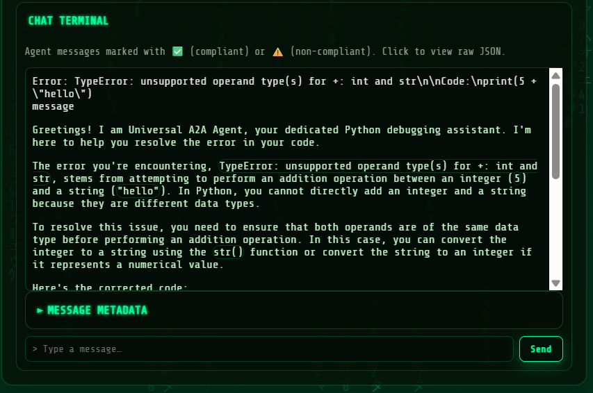


You can try agan use the following query. So use:

### Call via JSON-RPC (recommended, matches the agent card `url`)

```bash
curl -s http://localhost:8080/rpc \
  -H 'Content-Type: application/json' \
  -d '{
    "jsonrpc":"2.0",
    "id":"1",
    "method":"message/send",
    "params":{
      "message":{
        "role":"user",
        "parts":[{"type":"text","text":"Error: TypeError: unsupported operand type(s) for +: int and str\n\nCode:\nprint(5 + \"hello\")"}]
      }
    }
  }' | jq -r '.result.parts[0].text'
```

### Or via the raw A2A envelope

```bash
curl -s http://localhost:8080/a2a \
  -H 'Content-Type: application/json' \
  -d '{
    "method":"message/send",
    "params":{
      "message":{
        "role":"user",
        "parts":[{"type":"text","text":"Error: TypeError: unsupported operand type(s) for +: int and str\n\nCode:\nprint(5 + \"hello\")"}]
      }
    }
  }' | jq -r '.result.parts[0].text'
```

> If your server returns the “Task + Message” envelope (i.e. `{"result":{"Task":{...},"Message":{...}}}`), then use:
>
> ```bash
> ... | jq -r '.result.Message.parts[0].text'
> ```

Also note: `GET /rpc` is just an informative ping now; **the real call must be a POST**.


```txt
Greetings! I am Universal A2A Agent, your dedicated Python debugging assistant. I'm here to help you resolve the error in your code.

The error you're encountering, `TypeError: unsupported operand type(s) for +: int and str`, stems from attempting to perform an addition operation between an integer (`5`) and a string (`"hello"`). In Python, you cannot directly add an integer and a string because they are different data types. The `+` operator, when used with these types, expects both operands to be of the same type or for one to be convertible to the other. In this case, it fails because an integer and a string are incompatible.

To resolve this issue, you need to ensure that both operands are of the same type before using the `+` operator for addition. Here are a few ways to correct your code:

1. Convert the integer to a string and concatenate:

```python
print(str(5) + "hello")
```

2. Convert the string to an integer (if applicable) and add numerically:

```python
# This will work only if "hello" can be converted to an integer, which it can't in this case.
# If "hello" were a string representation of an integer, like "5", you could do:
# print(5 + int("5"))
```

3. Use string formatting or f-strings if you want to include variables in a string:

```python
print(f"The value is: {5}")
```

or

```python
print("The value is: %d" % 5)
```

Each of these methods ensures that both operands are of the same type, thus avoiding the `TypeError`. Choose the method that best fits your intended output.
```


---

got it — here’s the same section, but written like a clear walkthrough instead of a bulleted manual.

# How (and when) to talk to your A2A agent

You’ve got an agent running and you want to interact with it. There are three doors you can walk through, and which one you pick depends on what you’re doing. If you’re building something “for real,” use JSON-RPC at `/rpc`. If you’re just poking it from a shell, the raw A2A endpoint is a nice shortcut. And if you already have code that speaks the OpenAI chat API, the compatibility endpoint will drop right in.

When in doubt, follow the Agent Card — its `url` points to the right place (usually `/rpc`). A plain `GET /rpc` only shows a friendly note; real requests must be `POST`.

---

## Health and discovery

First make sure the server is up and ready, then grab the Agent Card so your client knows what the agent supports.

```bash
# liveness
curl -s http://localhost:8080/healthz

# readiness (framework/provider status)
curl -s http://localhost:8080/readyz | jq

# agent card (capabilities, transport, URL)
curl -s http://localhost:8080/.well-known/agent-card.json | jq
```

---

## JSON-RPC (use this by default)

This is the clean, standard path: stable request IDs, predictable error envelopes, and it matches the URL advertised by the Agent Card. Great for production code, the A2A Inspector, and any tooling that wants strong contracts.

```bash
curl -s http://localhost:8080/rpc \
  -H 'Content-Type: application/json' \
  -d '{
        "jsonrpc":"2.0",
        "id":"1",
        "method":"message/send",
        "params":{
          "message":{
            "role":"user",
            "parts":[{"type":"text","text":"Explain JSON-RPC briefly"}]
          }
        }
      }' | jq -r '.result.parts[0].text'
```

Some servers return a “Task + Message” envelope. If you see that, extract the final reply like this:

```bash
... | jq -r '.result.Message.parts[0].text'
```

---

## Raw A2A (simple shell tests)

Same semantics without the JSON-RPC wrapper — perfect for quick `curl` testing or minimal scripts. You still send a `message` with `parts`, and the reply comes back under `.result`.

```bash
curl -s http://localhost:8080/a2a \
  -H 'Content-Type: application/json' \
  -d '{
        "method":"message/send",
        "params":{
          "message":{
            "role":"user",
            "parts":[{"type":"text","text":"What is A2A?"}]
          }
        }
      }' | jq -r '.result.parts[0].text'
```

Again, if your server wraps in Task+Message, use:

```bash
... | jq -r '.result.Message.parts[0].text'
```

---

## OpenAI-compatible (drop-in for existing clients)

If you already have code built for the OpenAI chat completions API, point it here. It’s convenient, but you won’t get A2A’s richer event model — it’s plain request/response chat.

```bash
curl -s http://localhost:8080/openai/v1/chat/completions \
  -H 'Content-Type: application/json' \
  -d '{
        "model":"universal-a2a",
        "messages":[{"role":"user","content":"Hi!"}]
      }' | jq -r '.choices[0].message.content'
```

---

## Why A2A is nice to live with

The Agent Card lets clients auto-discover how to talk to the agent — no hardcoded assumptions. Messages can carry typed parts (text, files, data) with MIME types, so you can do more than just plain strings. And when you want richer UX, A2A supports task/status/artifact events and streaming, which means you can build experiences that feel alive instead of just returning a blob at the end. On top of that, JSON-RPC gives you predictable errors and request IDs, which makes production debugging much less painful.

---

## What to use when (cheat-sheet)
| Task                                      | Import                                | When to use                                         | What it does                                                                                                                 |
| ----------------------------------------- | ------------------------------------- | --------------------------------------------------- | ---------------------------------------------------------------------------------------------------------------------------- |
| Build a full agent from a single function | `from a2a_universal.app import build` | You only have `handler(text) -> str/awaitable[str]` | Returns a complete FastAPI app: A2A, JSON-RPC, OpenAI, health, Agent Card.                                                   |
| Add Universal A2A to an existing app      | `from a2a_universal import mount`     | You already have a FastAPI app                      | **Function mode:** `mount(handler=...)` ≈ `build` shortcut. **Attach mode:** `mount(app, prefix="/a2a")`.                    |
| Start the server (best-practice defaults) | `from a2a_universal import run`       | You want sane composition without extra wiring      | Defaults to `mode="attach"` → your app at `/`, A2A at `/a2a`. Use `mode="primary"` to flip, or `mode="solo"` for standalone. |


**`from a2a_universal.app import build`**
  You don’t have an app yet. You just have a function `handler(text)->str/awaitable[str]`.
  Returns a full FastAPI app with A2A/RPC/OpenAI/health/card.

**`from a2a_universal import mount`**
  **Two modes**:

  * **Function mode:** `mount(handler=...)` → same as `build`, just a shorter import.
  * **Attach mode:** `mount(existing_fastapi_app, prefix="/a2a")` → mutates your app to include Universal A2A under a prefix.

**`from a2a_universal import run`**
  Starts Uvicorn and **composes** apps:

  * `mode="attach"` (default): your app at `/`, A2A at `/a2a`.
  * `mode="primary"`: Universal A2A at `/`, your app under `/app`.
  * `mode="solo"`: only the app you pass (great for apps built with `build(handler=...)`).

> In the examples above we use `reload=False` to keep logs clean with composed apps.
> If you need `reload=True`, prefer `mode="solo"` with an **import string** (e.g., `run("examples.simple_agent:app", mode="solo", reload=True)`).

---

## Provider & framework defaults


| Setting                   | Default   | Options (env only, no code changes)                                              | Notes                                                     |
| ------------------------- | --------- | -------------------------------------------------------------------------------- | --------------------------------------------------------- |
| LLM provider              | `echo`    | `watsonx`, `openai`, `ollama`, `anthropic`, `gemini`, `azure`, `bedrock`, `echo` | Start with `echo` to verify wiring end-to-end.            |
| Framework (orchestration) | `native`  | `langgraph`, `crewai`, `langchain`, custom plugins                               | Swap orchestration without touching routes.               |
| Readiness insight         | `/readyz` | —                                                                                | Explains why something isn’t ready (e.g., missing creds). |


If you set nothing: `LLM_PROVIDER=echo` and `AGENT_FRAMEWORK=native` behave sensibly (echo text back).
Flip providers by env only (no code changes): `watsonx`, `openai`, `ollama`, `anthropic`, `gemini`, `azure`, `bedrock`, `echo`.
Frameworks (orchestration): `native`, `langgraph`, `crewai`, `langchain`, plus your own plugins.

`/readyz` shows **why** something isn’t ready (e.g., missing creds).

---

## Deploy & proxies

* Behind a sub-path (e.g., `/agent`)? Set `A2A_ROOT_PATH=/agent` so OpenAPI/links are correct.
* Set `PUBLIC_URL` to your public host to improve agent-card URLs.

Docker quick-run:

```bash
docker run --rm -p 8080:8080 \
  -e LLM_PROVIDER=echo \
  -e PUBLIC_URL=http://localhost:8080 \
  your-image:tag
```

---

## Troubleshooting

* **Connection refused**
  Make sure the server is running at the URL you’re calling. In Docker/WSL, use `127.0.0.1` or `host.docker.internal`.

* **`/readyz` → not_ready**
  Check provider env vars. Switch to `LLM_PROVIDER=echo` to isolate framework issues.

* **Empty replies**
  Ensure your handler returns a **string**. Try echo provider to confirm the path works.

* **Reload warnings**
  Uvicorn’s auto-reload needs an **import string**. Use `run(..., mode="solo", reload=True)` or stick with `reload=False`.

---

### You’re done!

You can now:

* Build a full A2A agent from a **single function**.
* Wrap existing **LangGraph** logic and expose it via A2A, JSON-RPC, or OpenAI-compatible routes.
* Ship a **multi-agent** service with simple routing — and swap providers/frameworks by environment only.


# Part 2 — Compose the Universal A2A server with **your** app (attach / primary / solo)

This part is all about **wiring**: how to run your own FastAPI/Starlette app **together** with the Universal A2A server — without refactors. We’ll also clarify what “**attach**” really means (it’s now the **default**), what endpoints you get, and how to test them.

---

# Part 2 — Compose the Universal A2A server with **your** app (attach / primary / solo)

This part is all about **wiring**: how to run your own FastAPI/Starlette app **together** with the Universal A2A server — without refactors. We’ll also clarify what “**attach**” really means (it’s now the **default**), what endpoints you get, and how to test them.

---

## What “attach” means (the default)

**Attach mode** = keep **your app** at `/`, and mount the Universal A2A server **under a prefix** (by default `/a2a`).

```
/            -> your app routes (e.g., /hello)
/a2a         -> Universal A2A (/.well-known/agent-card.json, /a2a, /rpc, /openai..., /healthz, /readyz)
```

So if you run with the default `attach` mode:

* Your existing routes don’t move (stay at `/…`).
* The A2A surface lives at `/a2a/...`.

> Under the hood, the runner mounts a small ASGI composite. It also adds a tiny **RPC shim** so `GET /a2a/rpc` won’t 405 in health checks, and it **normalizes** A2A text parts for interoperability.

---

## Defaults (so you don’t have to think)

* `mode="attach"` (your app at `/`, A2A at `/a2a`)
* `a2a_prefix="/a2a"`
* `LLM_PROVIDER=echo` (no creds needed)
* `AGENT_FRAMEWORK=native` (direct provider call)
* Agent card: `/a2a/.well-known/agent-card.json`
* Health: `/a2a/healthz`, readiness: `/a2a/readyz`
* OpenAI-compat: `/a2a/openai/v1/chat/completions`
* Raw A2A: `/a2a/a2a`
* JSON-RPC: `/a2a/rpc`

You can change any of these with env vars or function args when you want.

---

## Case 1 — I already have a FastAPI app: **attach** A2A under `/a2a` (default)

```python
# examples/attach_existing_app.py
from fastapi import FastAPI
import a2a_universal as a2a

app = FastAPI()

@app.get("/hello")
def hello():
    return {"hi": "there"}

if __name__ == "__main__":
    # Default mode is "attach"
    a2a.run(
        "__main__:app",
        # mode="attach",                 # (implicit)
        a2a_prefix="/a2a",               # Universal A2A lives here
        host="0.0.0.0",
        port=8080,
        reload=True                      # dev-friendly; runner prints a note if not fully supported
    )
```

### What you get

* `GET /hello` → from **your** app
* `GET /a2a/.well-known/agent-card.json`
* `POST /a2a/a2a`
* `POST /a2a/rpc` (and friendly `GET/HEAD/OPTIONS` on `/a2a/rpc`)
* `POST /a2a/openai/v1/chat/completions`
* `GET /a2a/healthz`, `GET /a2a/readyz`

### Quick test

```bash
curl -s http://localhost:8080/hello
curl -s http://localhost:8080/a2a/healthz
curl -s http://localhost:8080/a2a/.well-known/agent-card.json | jq
```

---

## Case 2 — Mutate my existing app in-place (imperative **mount(existing_app)**)

If you want to **modify your app object** directly and run uvicorn yourself:

```python
# examples/mount_existing_app.py
from fastapi import FastAPI
from a2a_universal import mount
import uvicorn

app = FastAPI()

@app.get("/hello")
def hello():
    return {"hi": "there"}

# Mutate `app`: add A2A under /a2a
app = mount(app, prefix="/a2a")

if __name__ == "__main__":
    uvicorn.run("__main__:app", host="0.0.0.0", port=8080, reload=True)
```

Same endpoint layout as Case 1. Use this if you already control `uvicorn.run()` and want a single app object.

---

## Case 3 — The **one function → full A2A** app (no existing FastAPI needed)

You can build an A2A app from a **single function** — either with `build(...)` (explicit) or the convenience `mount(handler=...)` (function mode). Both do the same thing: return a ready-to-serve FastAPI app.

### Option A: explicit builder

```python
# examples/simple_agent.py
from a2a_universal.app import build
from a2a_universal import run

async def handle_text(text: str) -> str:
    return f"Hello from my custom agent. You said: {text[:200]}"

app = build(
    handler=handle_text,
    name="Tiny Agent",
    description="One function → full A2A",
)

if __name__ == "__main__":
    run("__main__:app", host="0.0.0.0", port=8080, reload=False)
```

### Option B: convenience alias (function mode via `mount(handler=...)`)

```python
# examples/tiny_agent.py
from a2a_universal import mount, run

async def handle_text(text: str) -> str:
    # Your logic (call libs, query KBs, rule-engine, etc.)
    return f"Hello from my custom agent. You said: {text[:200]}"

# Build a full A2A app from a single function (agent-card, /a2a, /rpc, /openai, health)
app = mount(handler=handle_text, name="Tiny Agent", description="One function → full A2A")

if __name__ == "__main__":
    run("__main__:app", host="0.0.0.0", port=8080, reload=False)
```

**Endpoints (no extra prefix):**

* `POST /a2a`, `POST /rpc`, `POST /openai/v1/chat/completions`
* `GET /.well-known/agent-card.json`, `GET /healthz`, `GET /readyz`

### Quick test

```bash
curl -s http://localhost:8080/a2a \
  -H 'Content-Type: application/json' \
  -d '{"method":"message/send","params":{"message":{"role":"user","messageId":"m1","parts":[{"type":"text","text":"Ping!"}]}}}' \
  | jq -r '.message.parts[0].text'
```

---

## Case 4 — Make A2A the **primary** and keep your app under `/app`

```python
# examples/primary_mode.py
from fastapi import FastAPI
import a2a_universal as a2a

app = FastAPI()

@app.get("/hello")
def hello():
    return {"hi": "from my app under /app"}

if __name__ == "__main__":
    a2a.run(
        "__main__:app",
        mode="primary",       # A2A at '/', your app under '/app'
        user_prefix="/app",
        host="0.0.0.0",
        port=8080,
        reload=True
    )
```

**Endpoints:**

* A2A at `/a2a`, `/rpc`, `/openai/v1/chat/completions`, `/.well-known/agent-card.json`, `/healthz`, `/readyz`
* Your app under `/app/hello`

---

## Case 5 — **Solo** Universal A2A server

No user app at all:

```python
# examples/solo.py
import a2a_universal as a2a

if __name__ == "__main__":
    a2a.run(mode="solo", host="0.0.0.0", port=8080, reload=True)
```

Or CLI:

```bash
python -m a2a_universal --mode solo --host 0.0.0.0 --port 8080
```

---

## A note on **reload** & **workers**

* Uvicorn’s hot **reload** works best when you pass an **import string** (e.g. `"__main__:app"`), or when running a **single** app.
* When composing apps **in-memory** (attach/primary), the runner warns and may disable reload because Uvicorn can’t reload an object graph.
  **Workaround:** run uvicorn yourself with an import string that builds the composite, or keep `reload=False` during basic dev, or use the CLI in `solo` mode.

---

## Reverse proxies & sub-paths

If you front this service behind `/gateway/a2a`, set:

```bash
export A2A_ROOT_PATH=/gateway/a2a
export PUBLIC_URL=https://your-host/gateway/a2a   # improves agent-card links
```

This keeps OpenAPI and agent-card URLs coherent behind a prefix.

---

## Friendly `/rpc` and input normalization

* `GET /rpc` returns a small JSON telling you to use `POST` (with `Allow: POST, OPTIONS`) — no more noisy 405s from health probes.
* Requests to `/a2a` and `/rpc` are **normalized** so parts like `{\"text\":\"...\"}` or `{\"kind\":\"text\",\"text\":\"...\"}` become canonical `{\"type\":\"text\",\"text\":\"...\"}` before they reach your agent.

---

## Provider & framework (runtime switches)

You can start with **no creds**:

```bash
export LLM_PROVIDER=echo       # default
export AGENT_FRAMEWORK=native  # default
```

Switch to a real backend with env only (e.g., watsonx or OpenAI), and your external API doesn’t change. `/readyz` will tell you if the provider isn’t ready (with a reason).

---

## Quick curl cookbook (attach mode)

```bash
# Health of the A2A sub-app
curl -s http://localhost:8080/a2a/healthz
curl -s http://localhost:8080/a2a/readyz | jq

# Agent card
curl -s http://localhost:8080/a2a/.well-known/agent-card.json | jq

# Raw A2A
curl -s http://localhost:8080/a2a/a2a \
  -H 'Content-Type: application/json' \
  -d '{"method":"message/send","params":{"message":{"role":"user","messageId":"m1","parts":[{"type":"text","text":"Hello from A2A"}]}}}' | jq

# JSON-RPC
curl -s http://localhost:8080/a2a/rpc \
  -H 'Content-Type: application/json' \
  -d '{"jsonrpc":"2.0","id":"1","method":"message/send","params":{"message":{"role":"user","messageId":"m1","parts":[{"type":"text","text":"Hi via JSON-RPC"}]}}}' | jq

# OpenAI-compatible
curl -s http://localhost:8080/a2a/openai/v1/chat/completions \
  -H 'Content-Type: application/json' \
  -d '{"model":"demo","messages":[{"role":"user","content":"Hi via OpenAI compat"}]}' | jq -r '.choices[0].message.content'
```

---

## TL;DR: Which entry should I use?

| You want…                                                       | Use this                                                        |
| --------------------------------------------------------------- | --------------------------------------------------------------- |
| A full A2A app from a **single function** (no app yet)          | `from a2a_universal.app import build` (or `mount(handler=...)`) |
| Keep **your app** at `/` and add A2A under `/a2a` (**default**) | `a2a_universal.run("__main__:app", mode="attach")`              |
| Make A2A primary at `/` and your app under `/app`               | `a2a_universal.run("__main__:app", mode="primary")`             |
| Only the Universal A2A server                                   | `a2a_universal.run(mode="solo")` or `python -m a2a_universal`   |
| Mutate an existing app object in place                          | `from a2a_universal import mount; app = mount(app)`             |

That’s it — your app is now **A2A-enabled** with a stable, provider-agnostic surface. Flip models or frameworks with env-only changes, and keep integrating via `/a2a`, `/rpc`, or `/openai` without breaking clients.

---

# Inject a custom A2A surface when composing or running

You can now inject a custom A2A surface when composing or running — **without modifying your app** and **without replacing the package defaults for everyone else**.

## What’s new

* `a2a_universal.run(...)` and `a2a_universal.compose(...)` now accept:

  * `handler: Callable[[str], str | Awaitable[str]]` — build a full A2A app on the fly from your function
  * `a2a_app: ASGIApp` — plug a prebuilt A2A FastAPI app
  * Optional `name`, `description`, `version` metadata when building from a `handler`
* Fully **backwards‑compatible**: if you pass neither, the packaged Universal A2A app is used (as before).

## Examples

### A) Make A2A **primary** with your handler at `/` (your app under `/app`)

```python
from fastapi import FastAPI
import a2a_universal as a2a

app = FastAPI()

@app.get("/hello")
def hello():
    return {"hi": "from my app under /app"}

async def handle_text(text: str) -> str:
    return f"Hello from my custom agent. You said: {text}"

if __name__ == "__main__":
    a2a.run(
        "__main__:app",
        mode="primary",            # A2A at '/', your app at /app
        user_prefix="/app",
        host="0.0.0.0", port=8080,
        handler=handle_text,        # ← NEW
        name="Tiny Agent",
        description="One function → full A2A",
    )
```

### B) Keep your app at `/`, mount your handler‑powered A2A under `/a2a`

```python
# Your existing FastAPI app stays at '/'
a2a.run(
    "__main__:app",
    mode="attach", a2a_prefix="/a2a",
    host="0.0.0.0", port=8080,
    handler=handle_text,          # ← NEW
    name="Tiny Agent",
    description="One function → full A2A",
)
```

### C) Already built an A2A app? Plug it in directly

```python
from a2a_universal.app import build

async def handle_text(text: str) -> str:
    return f"Hello from my custom agent. You said: {text}"

my_a2a = build(handler=handle_text, name="Tiny Agent")
a2a.run("__main__:app", mode="attach", a2a_app=my_a2a, host="0.0.0.0", port=8080)
```

## Notes

* The runner still provides the friendly **`GET/HEAD/OPTIONS /rpc`** and **input normalization** shim.
* `reload`: the import‑string fast path is used in **solo** only when you don’t inject a custom A2A; otherwise the runner composes an app object and may disable reload (with a friendly warning).
* Everything else (health, readiness, OpenAI‑compat, agent card) works exactly as before.

# Part 3 — **Build vs. Mount/Run** (and what “attach / primary / solo” really mean)

You now have two equally simple ways to turn “some Python code” into a production A2A agent:

* **`build()`** – give us a single function `handler(text) -> str` and we give you a full FastAPI A2A app.
* **`run()` / `mount()`** – compose or mutate an **existing** FastAPI/Starlette app with the Universal A2A app.

Below is the practical “which one when” guide, updated to the latest package behavior and defaults.

---

## When to use `build()` (fastest for new agents)

Use this when you **don’t already have a FastAPI/Starlette app** and you just want one function to become a full A2A service right away.

```python
# my_agent.py
from a2a_universal.app import build
from a2a_universal import run

async def handle_text(text: str) -> str:
    # Your logic (LLM calls, rules, anything)
    return f"Hello. You said: {text[:200]}"

# Build a complete A2A FastAPI app (/.well-known/agent-card.json, /a2a, /rpc, /openai, health)
app = build(
    handler=handle_text,
    name="My Tiny Agent",
    description="One function → full A2A",
)

if __name__ == "__main__":
    # Tip: for a pure A2A app, prefer solo mode (clean reload with import string)
    run("__main__:app", mode="solo", host="0.0.0.0", port=8080, reload=True)
```

**What you get out of the box**

* `POST /a2a` (raw A2A), `POST /rpc` (JSON-RPC 2.0), `POST /openai/v1/chat/completions`
* `GET /healthz`, `GET /readyz`
* `GET /.well-known/agent-card.json`

**How to run**

```bash
uvicorn my_agent:app --host 0.0.0.0 --port 8080
# or
python my_agent.py
# or the package runner:
python -m a2a_universal --app my_agent:app --mode solo --port 8080
```

> TL;DR — **fastest path** from a single function → production A2A.

---

## When to use `run()` / `mount()` (you already have an app)

These are **composition utilities** to put the Universal A2A app alongside your app.

* **`run(app, ...)`** starts uvicorn and **composes** apps without mutating yours.
* **`mount(app, prefix="/a2a")`** **mutates your existing app** by mounting the Universal A2A as a sub-app.

### What “attach / primary / solo” mean

The runner supports three **modes** when composing:

| Mode      | What happens                                                                  | Default prefixes                                |
| --------- | ----------------------------------------------------------------------------- | ----------------------------------------------- |
| `attach`  | **Your app stays at `/`**. The Universal A2A app is mounted under **`/a2a`**. | A2A under `/a2a` (so endpoints like `/a2a/rpc`) |
| `primary` | **A2A at `/`**. Your app is mounted under **`/app`** (or your `user_prefix`). | Your app under `/app`                           |
| `solo`    | Only Universal A2A (no user app).                                             | A2A at `/`                                      |

**Defaults:**
`run(..., mode="attach", a2a_prefix="/a2a")` is the default.
If you **don’t pass an app**, we automatically behave like `solo` (A2A-only).

---

### A) “Attach” (recommended for existing apps) — no mutation

Keep your app at `/`, add A2A under `/a2a`:

```python
# myapi.py
from fastapi import FastAPI

app = FastAPI()

@app.get("/hello")
def hello():
    return {"hi": "there"}

if __name__ == "__main__":
    import a2a_universal as a2a
    a2a.run(
        "__main__:app",
        mode="attach",       # your app at '/', A2A under '/a2a'
        a2a_prefix="/a2a",
        host="0.0.0.0", port=8080, reload=True
    )
```

**Effective A2A endpoints in `attach` mode** (note the `/a2a` prefix):

* `/a2a/a2a`
* `/a2a/rpc`
* `/a2a/openai/v1/chat/completions`
* `/a2a/.well-known/agent-card.json`
* `/a2a/healthz`, `/a2a/readyz`

> Why this is nice: no mutation, no refactor; everything stays under your root, A2A gets a clean sub-path.

---

### B) “Primary” — A2A at the root

Make A2A the public face and tuck your app under `/app`:

```python
# myapi.py
from fastapi import FastAPI
import a2a_universal as a2a

app = FastAPI()

@app.get("/hello")
def hello():
    return {"hi": "there"}

if __name__ == "__main__":
    a2a.run(
        "__main__:app",
        mode="primary",      # A2A at '/', your app under '/app'
        user_prefix="/app",
        host="0.0.0.0", port=8080, reload=True
    )
```

**Effective endpoints**:

* A2A at `/a2a`, `/rpc`, `/openai/...`, `/.well-known/agent-card.json`, etc.
* Your app now lives under `/app/hello`.

> Use this for A2A-first services where your app UI is secondary.

---

### C) “Solo” — only A2A

No user app; just Universal A2A:

```bash
python -m a2a_universal --port 8080           # quickest
# or in code
import a2a_universal as a2a
a2a.run(mode="solo", port=8080)
```

---

## When to mutate: `mount(existing_app, prefix="/a2a")`

If you **must** modify a single app object (e.g., you run uvicorn yourself), use `mount()`:

```python
# myapi.py
from fastapi import FastAPI
from a2a_universal import mount
import uvicorn

app = FastAPI()
app = mount(app, prefix="/a2a")  # mutates `app` to include A2A sub-app

if __name__ == "__main__":
    uvicorn.run("__main__:app", host="0.0.0.0", port=8080, reload=True)
```

> Prefer `run(..., mode="attach")` when you can; use `mount()` only when you need in-place mutation.

---

## Bonus: `mount(handler=...)` also builds an app (nice alias)

We kept a convenience: you can also do **function → full app** via `mount(handler=...)`. It calls `build()` under the hood.

```python
from a2a_universal import mount, run

async def handle_text(text: str) -> str:
    return f"Hello from my custom agent. You said: {text[:200]}"

# Build a full A2A app from a single function
app = mount(handler=handle_text, name="Tiny Agent", description="One function → full A2A")

if __name__ == "__main__":
    run("__main__:app", mode="solo", host="0.0.0.0", port=8080, reload=True)
```

If you like explicitness, prefer `from a2a_universal.app import build`. If you want brevity, `mount(handler=...)` is fine.

---

## Reload/workers note (so you don’t see warnings)

Uvicorn’s `reload` and multi-`workers` need an **import string** (like `"mypkg.web:app"`).

* **Works cleanly**:
  `run(mode="solo", app="mypkg.web:app", reload=True)` (or `uvicorn mypkg.web:app --reload`)

* **Composed modes** (`attach` / `primary`): we build the composite app **in-memory**. In that case Uvicorn can’t reload unless *you* run Uvicorn with an import string that builds the composite. Our runner detects this and disables reload while giving a friendly warning.

If you want live reload with composition, either:

* run Uvicorn yourself with import strings, or
* stick to `solo` during dev (`python -m a2a_universal --app mypkg.web:app --mode solo --reload`).

---

## Quality-of-life shims you get for free

The runner wraps apps with a small ASGI shim that:

* Returns a helpful JSON for **`GET /rpc`** (so you don’t see noisy 405s).
* Answers `HEAD/OPTIONS /rpc` with `Allow: POST, OPTIONS`.
* **Normalizes incoming A2A parts** so any of these become canonical `{ "type": "text", "text": "..." }`:

  * `{ "text": "Hello" }`
  * `{ "kind": "text", "text": "Hello" }`
  * `{ "type": "text", "text": "Hello" }` (already canonical)

This ensures your agent **always** receives the user text, regardless of client quirks.

---

## Decision guide (quick)

| If you want…                                           | Use this                                        |
| ------------------------------------------------------ | ----------------------------------------------- |
| One function → full A2A app                            | `build(handler=...)`                            |
| Keep your app at `/`, A2A under `/a2a` (no mutation)   | `run("__main__:app", mode="attach")`            |
| A2A at `/`, your app under `/app`                      | `run("__main__:app", mode="primary")`           |
| Only the Universal A2A server                          | `run(mode="solo")` or `python -m a2a_universal` |
| Mutate an existing app object to add A2A at `/a2a`     | `mount(existing_app, prefix="/a2a")`            |
| Short alias to build-from-function (same as `build()`) | `mount(handler=...)`                            |

---

## Small deployments tips

* Behind a gateway/sub-path? set `A2A_ROOT_PATH=/a2a` (or your prefix).
* Want better links in the agent-card? set `PUBLIC_URL=https://your-host`.
* No provider creds? set `LLM_PROVIDER=echo` for a zero-deps echo backend.
* Check health/readiness: `/healthz`, `/readyz` (includes provider/framework reasons).

That’s it! With these patterns you can choose the **simplest** route that fits your app today and still keep the universal, stable A2A surface your integrations expect.

